# Groovy Language Notes

- Object oriented, dynamic programming language for Java platform.
- Created to simplify and enchance Java dev by providing flexible and concise syntax.
- Integrates easily with existing Java code allowing devs to use existing libraries and frameworks with concise and dynamic syntax.
- Also a scripting language where we can write quick scripts and execute it without the need of compilation.
- Provides functional programming support with closures and higher order functions.
- Groovy code gets compiled to Java bytecode, so it is compatible with JVM.

## Use cases of groovy

- Most useful scenario is when devs want to use the power of Java but need more concise and expressive code.
- Scripting and automation: Automating build task in Jenkins or Gradle.
- Build automation (gradle): Defining dependencies in `build.gradle`
- Writing unit test for test automation.
- Web deb: Building RESTful web services with Grails.
- Domail specific language (DSLs)
- Scripting in CI: Scripting Jenkins pipelines.

## Comparison with Java


## Programming with groovy

- We can download the groovy SDK from [official download page](https://groovy.apache.org/download.html)
- Groovy scripts are created with `.groovy` extension.
- If creating a groovy class, make sure the file name and the class name is same following PascalCase.
- If creating a groovy script, the file name can be either PascalCase or snake_case.
- Execute a groovy script with the command `groovy fileName.groovy`.

## Printing in groovy

- `println()` adds a new line after the text is printed.

```groovy
println "Hello World"
println("Hello World")

print("hello world")
```

## Comments

```groovy
// Single line comment

/*
    Multi
    Line
    Comment
*/

/**
* GroovyDoc comment
* It is used for documentation
* @param a is the first number
* @param b is the second number
* @return sum of a and b
*/
```

## Variables

- No need to explicitly specify the type as it is a dynamically typed language.
- However, we can still explicitly specify the type.

### Dynamically typed variables

```groovy
// Syntax
def variableName = value

def name = "Parth" // Dynamically typed string
def age = 26 // Dynamically typed integer
def isSingle = true // Dynamically typed boolean
def height = 6.0 // Dynamically typed BigInteger
```

### Explicitly typed variables

```groovy
// Syntax
Type variableName = value

String name = "parth" // Explicitly typed string
int age = 26 // Explicitly typed integer
boolean isSingle = true // Explicitly typed boolean
double height = 6.0 // Explicitly typed double
```

### Variable scope

- Defines accessibility/ visibility of a variable.
- _Local scope:_ Within methods or closures.
- _Instance scope:_ Defined at class level which is accessible by all methods in that class.
- _Global scope:_ Specifically in script, the variables defined outside a class or a method have global scope.

```groovy
def myFunction() {
    int age = 26 // Local variable
}

println(age) // Throw an exception MissingPropertyException as variable age is out of the scope
```

### Multiple assignments

```groovy
def (x, y, z) = [1,2,3]
println x // 1
println y // 2
println z // 3
```

### Default values

- Reference types -> null
- Primitive types -> Native default value

### Duck typing

- Provides more flexibility as compared to statically typed language like Java.

```groovy
def value = 69
value = "Oh yeah" // Re-initialized value

println value // Oh yeah
```

## String interpolation

- The `$` symbol is used for string interpolation which allows us to embed variables or expression directly in a string.
- Makes it easy to concatenate string with variables without having to use the + operator.

```groovy
def name = "parth"
def age = 26

println("Hi, I am $name. I am $age years old")

// Output:
// Hi, I am parth. I am 26 years old
```

## Data types in groovy

- Groovy is a dynamic programming language but also supports static declarations with the below data types:

### Primitive data types

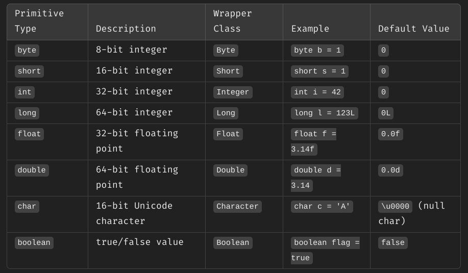

### Object data types

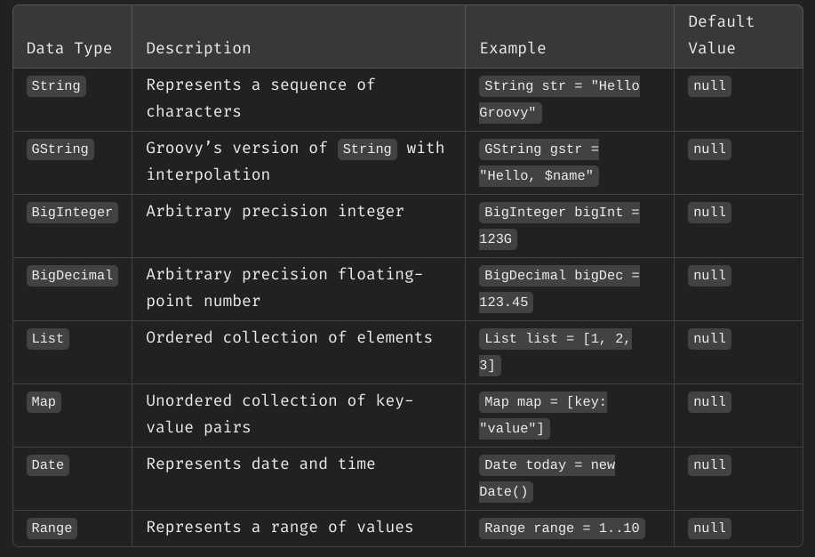

### Collection types

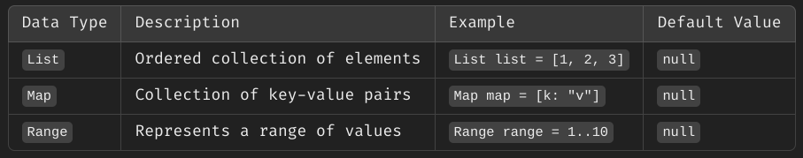

### Special data types

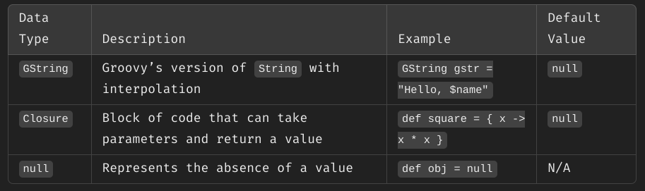

### Primitive vs wrapper types

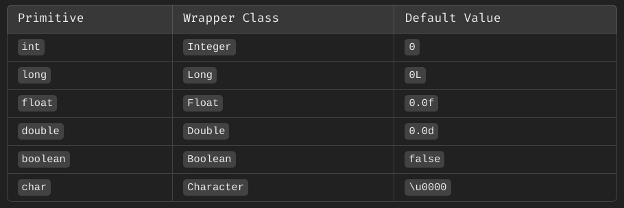

- When a variable is declared but not explicitly initialized, it generally defaults to `null`, except for primitive types that have their default values.

### How to know a data type of a variable

#### Using `getClass()`

```groovy
def a = 123
println(a.getClass()) // Output: class java.lang.Integer
```

#### Using `instanceof`

```groovy
def a = 123
println(a instanceof Byte) // false
println(a instanceof Short) // false
println(a instanceof Integer) // true
```

## Operators in groovy

### Arithmetic operators

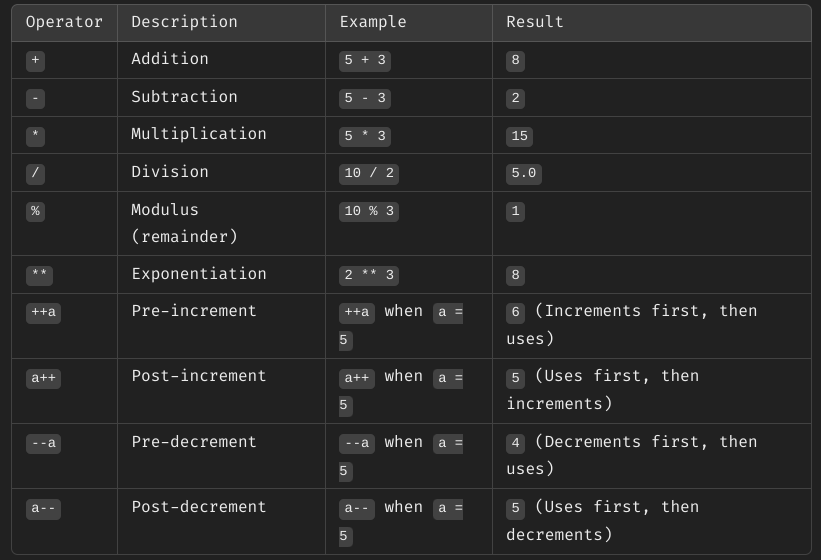

### Relational operators

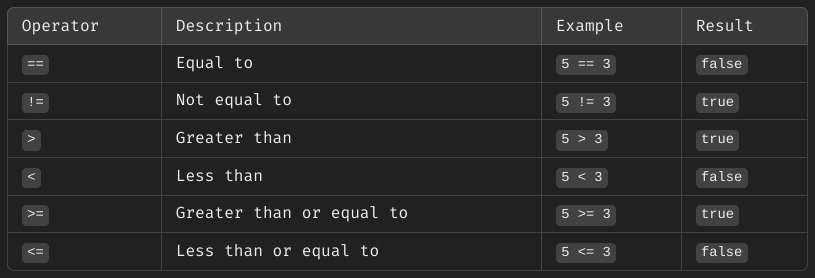

### Logical operators

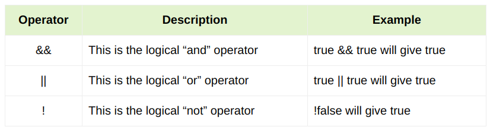

### Bitwise operators

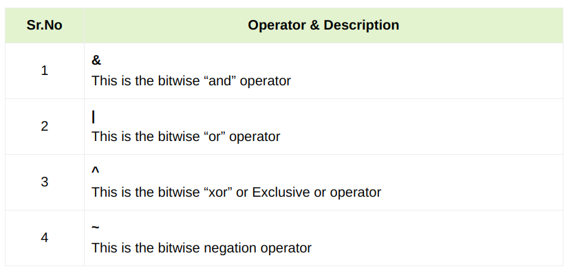

### Assignment operators

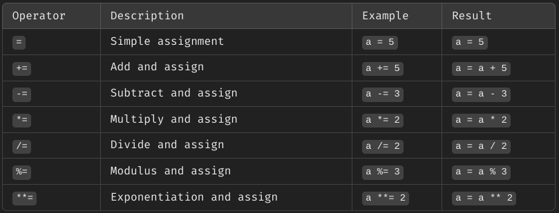

### Ternary operator

```groovy
condition ? valueIfTrue : valueIfFalse
```

### Elvis operator

- Shorthand version of the ternary operator when checking for `null` values.
- If the expression on the left is `null`, it returns the expression on the right.

```groovy
// Syntax
expression ?: defaultValue

// Example
def name = null
def displayName = name ?: "Guest"
println displayName // Guest
```

### Null safe operator

- Prevents `NullPointerException`.
- If the object is `null`, it will result in `null` instead of throwing the exception.

```groovy
// Syntax
object?.method()

// Example
def person = null
println person.name

/*Output:
Caught: java.lang.NullPointerException: Cannot get property 'name' on null object
java.lang.NullPointerException: Cannot get property 'name' on null object
	at Main.run(Main.groovy:2)
*/

println person?.name // null
```

### Range operator

- Used to create a sequence of values such as numbers or characters.

```groovy
// Syntax
start..end

// Example
def range1 = 1..5
def range2 = 'a'..'e'

println range1.toListString() // [1, 2, 3, 4, 5]
println range2.toListString() // [a, b, c, d, e]
```

### Spread operator

- The spread operator is used to invoke a method or access a property on all elements in a collection.

```groovy
def list = ['apple', 'banana', 'cherry']
println list*.toUpperCase()  // Output: [APPLE, BANANA, CHERRY]
```

### Spaceship operator

- The spaceship operator returns -1, 0, or 1 when comparing two values.
- It's used for comparison and sorting.

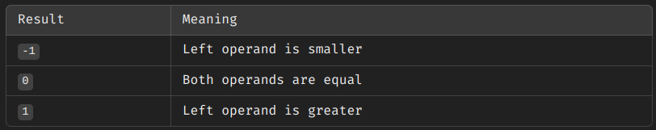

```groovy
println 5 <=> 3  // Output: 1
println 5 <=> 5  // Output: 0
println 3 <=> 5  // Output: -1
```

## Conditional statements

### If-else

```groovy
if (condition) {
    // code to execute if condition is true
} else if (anotherCondition) {
    // code to execute if anotherCondition is true
} else {
    // code to execute if all conditions are false
}
```

#### Truthy and falsy values

- Truthy values: Any non-null or non-false value (non-zero numbers, non-empty strings, collections).
- Falsy values: null, false, empty collections or strings, and 0.

```groovy
def str = "Groovy"
if (str) {
    println "String is not empty"  // Evaluates true since str is non-empty
}
```

### Switch case

- Groovy's switch case can also evaluate strings, ranges and collections.

```groovy
// Syntax
switch (variable) {
    case value1:
        // code for case 1
        break
    case value2:
        // code for case 2
        break
    default:
        // code for default case
}
```

## Looping statements

### for loop

```groovy
for (initialization; condition; increment) {
    // code to execute
}
```

### for-in loop

- Used widely to loop over collections.

```groovy
// Syntax
for (item in collection) {
    // code to execute
}

// Example
def str = "parth"

for(character in str) {
	println(character)
}

/*
Output:
p
a
r
t
h
*/

```

### while loop

```groovy
while (condition) {
    // code to execute
}
```

### do-while loop

```groovy
do {
    // code to execute
} while (condition)
```
